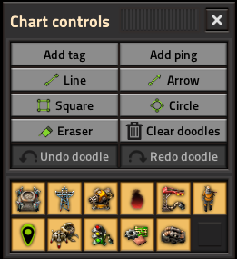
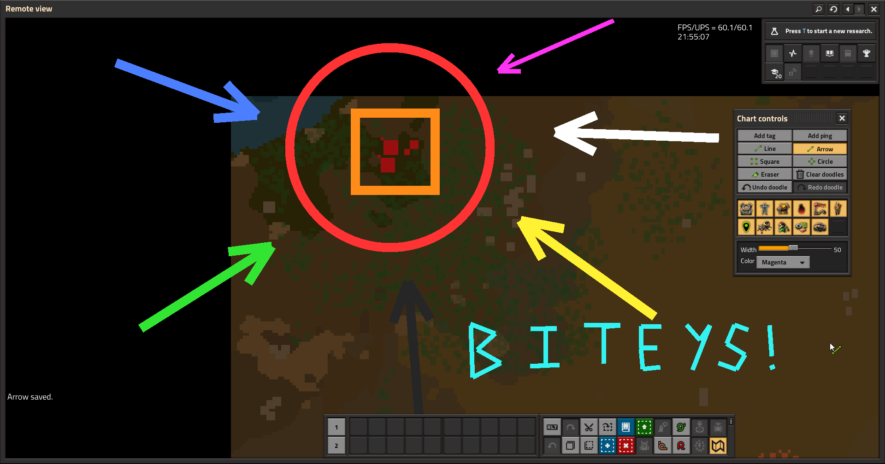

# Doodle

Draw lines, arrows, squares, circles, and eraser marks on the Factorio map chart. Doodle registers its tools in **Chart Controls** through [Extensible Map Overlay Framework](https://mods.factorio.com/mod/extensible-map-overlay-framework) (EMOF).

**Requires [Extensible Map Overlay Framework](https://mods.factorio.com/mod/extensible-map-overlay-framework) >= 0.1.0.**

## Quick start

1. Enable **Doodle** and **Extensible Map Overlay Framework**.
2. Open the map in chart view and open **Chart Controls**.
3. Pick a drawing tool (Line, Arrow, Square, Circle, or Eraser).
4. Left-click on the map to draw. For lines, use **Finish line** when you have at least two points.
5. Adjust width and color in the extension slot below the action buttons.

Undo and redo are available from Chart Controls and from keyboard shortcuts (see **Settings → Controls → Doodle**).

## Mod settings

Under **Settings → Mod settings → Doodle**:

| Setting | Type | Description |
|---------|------|-------------|
| Undo history size | Runtime (global) | Max undo/redo steps per player (5-200, default 50). |
| Minimum line width | Startup | Low end of the width slider (requires restart). |
| Maximum line width | Startup | High end of the width slider (requires restart). |
| Line width step | Startup | Slider increment (requires restart). |
| Default line color | Per user | **Player color** or a fixed preset. Applies to new player state, not existing lines. |

## Screenshots

## Source

[GitHub repository](https://github.com/djfariel/doodle)
